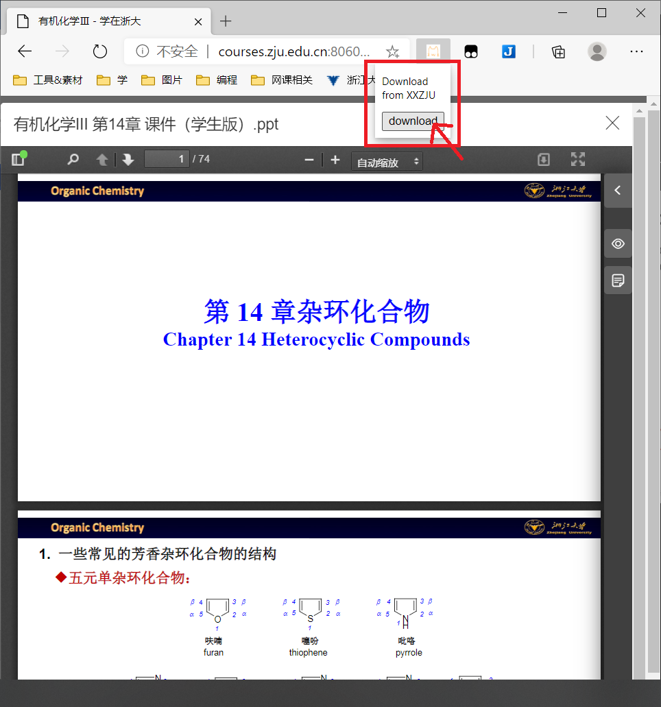

您能使用咱开发小小插件，不胜感激，现将安装方法和使用用法展示如下。

### 安装方法

对于chrome浏览器（即谷歌浏览器）以及其他chrome内核的浏览器，安装方法大致相同。下面以chrome浏览器为例子。

点击右上角三点 => 更多工具 => 扩展程序，进入chrome插件管理面板

右上角点开-开发者模式 => 加载已解压的扩展程序，并在弹出的选择文件夹窗口中，选择解压出来的文件夹

***

### 使用方法

打开任意一个ppt或pdf的文件，点开扩展，点击下载按钮。然后稍等一会，下载就开始了

### 最后

小小程序非完美，有意见欢迎提issue